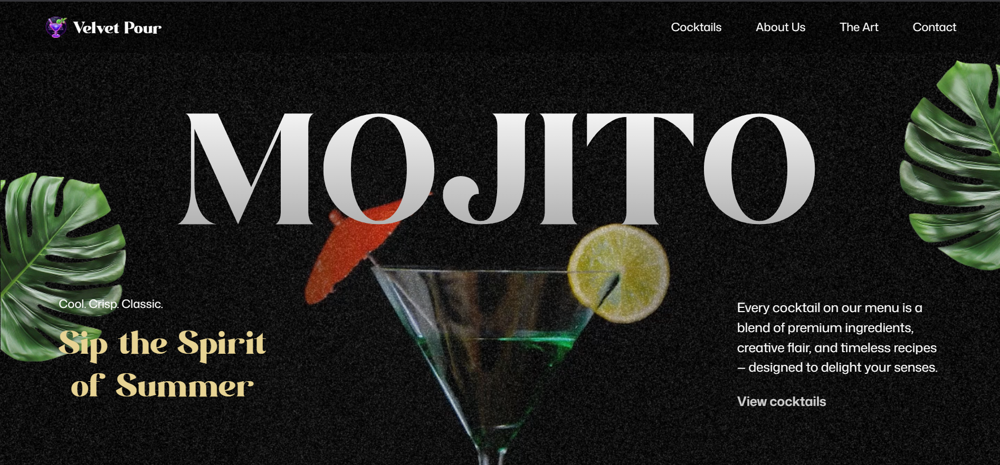
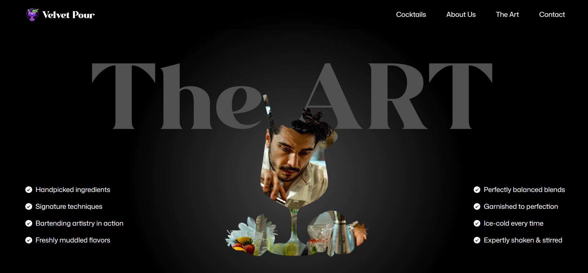
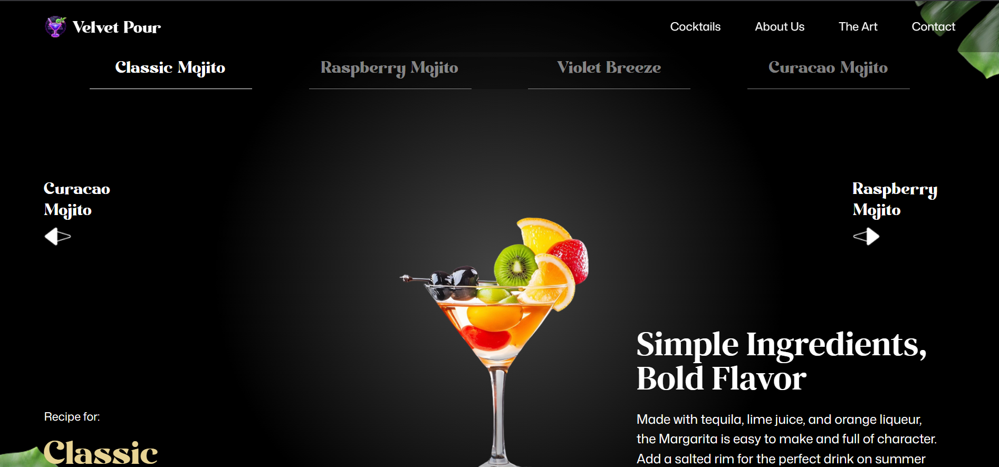

# 🍸 Cocktails GSAP Project

A modern, interactive frontend project built with **React**, **GSAP**, **Tailwind CSS**, and **Vite** — showcasing animated cocktail-themed UI and smooth transitions.

---

## 🚀 Tech Stack

- ⚛️ React (Vite)
- 🎨 Tailwind CSS
- ✨ GSAP (GreenSock)

---

## 📸 Preview

*A quick look at the UI & animation setup:*

<p align="center">
  <span style="display: inline-block; vertical-align: top;">
    <br>
    
  </span>
  <span style="display: inline-block; margin-left: 20px;">
    
  </span>
</p>


---

## ⚙️ Setup

```bash
git clone https://github.com/utkarsh0p/cocktails_gsap_project.git
cd cocktails_gsap_project
npm install
npm run dev

